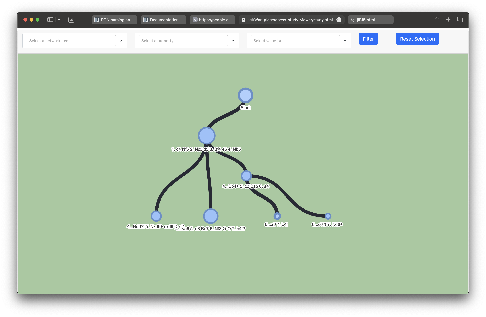

# chess-study-viewer

Used to parse PGN files containing chess studies, and generate an interactive tree graph to show the variations.



## Usage
```
python main.py [ YOUR_STUDY.pgn ]
```

Will output `[ YOUR_STUDY ].html`

### Future work
* Stylize graph edges to indicate main lines vs side lines
* Include move annotations (e.g. '!', indicating a great move) and move numbers when generating lines
* Include comments from the PGN file, attached to the edge representing that line
* Highlight important squares on each position displayed (show diff between lines, threats, etc)

### Python modules used
pyvis
chess
